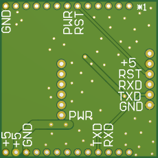
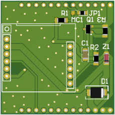

# Sim800L to EC200U converter PCB
this project use PCB for Sim800L to EC200U converter

# Hardware Design

## PCB Layers

## List Components

<a href="Documentation/Sim800-EC200U.pdf">
Download List Components PDF
</a>

## check List
- [x] add TVS and Zener diode for protection
- [x] set jummper for enable auto start or control start
